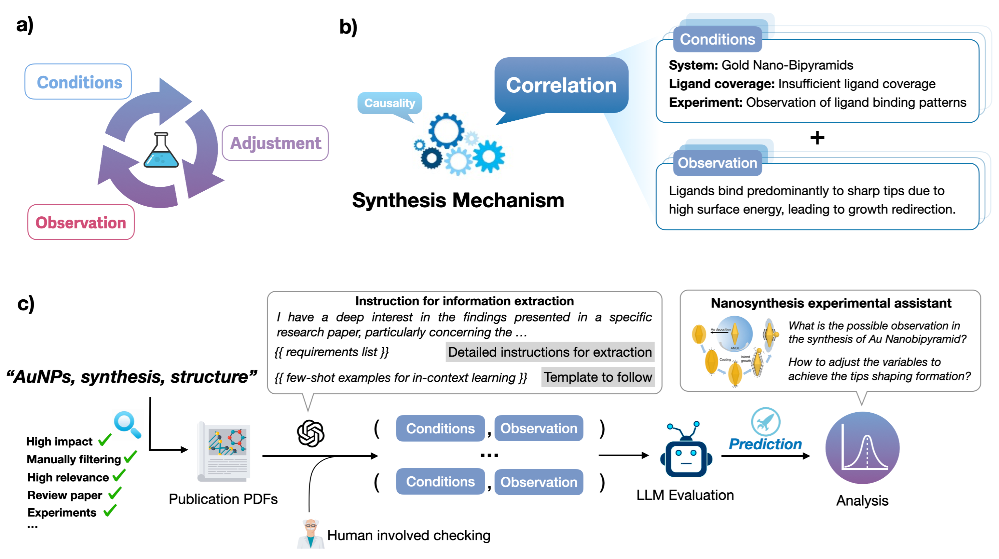
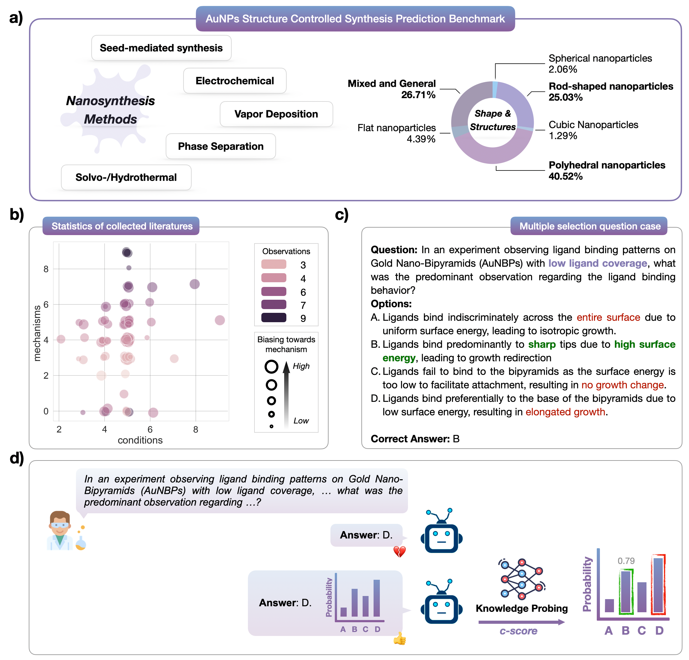

> The official repo for the paper _**[Leveraging large language models for nanaosynthesis mechanisms explanation](https://arxiv.org/abs/2407.08922)** (preprint)._


## Abstract

With the rapid development of artificial intelligence (AI), large language models (LLMs) such as GPT-4 have garnered significant attention in the scientific community, demonstrating great potential in advancing scientific discovery. This progress raises a critical question: are these LLMs well-aligned with real-world physicochemical principles? Current evaluation strategies largely emphasize fact-based knowledge, such as material property prediction or name recognition, but they often lack an understanding of fundamental physicochemical mechanisms that require logical reasoning. To bridge this gap, our study developed a benchmark consisting of 775 multiple-choice questions focusing on the mechanisms of gold nanoparticle synthesis. By reflecting on existing evaluation metrics, we question whether a direct true-or-false assessment merely suggests conjecture. Hence, we propose a novel evaluation metric, the confidence-based score (c-score), which probes the output logits to derive the precise probability for the correct answer. Based on extensive experiments, our results show that in the context of gold nanoparticle synthesis, LLMs understand the underlying physicochemical mechanisms rather than relying on conjecture. This study underscores the potential of LLMs to grasp intrinsic scientific mechanisms and sets the stage for developing more reliable and effective AI tools across various scientific domains.


<div align="center">
  
</div>

**Figure 1: Semantic illustration of our proposed framework for large language model evaluation in nanomaterial synthesis prediction, highlighting concepts and workflow.** a) nanosynthesis study loop: begins with basic conditions, leading to the discovery of novel synthesis rules through experiments involving variable adjustments. b) exemplifies the synthesis mechanism, dissected into causality and correlations, with an emphasis on correlations described through condition-observation pairs. c) outlines the process from sourcing relevant literature (using key area keywords) for benchmark construction and model evaluation.


## Dataset

We manually created the dataset for evaluation. It is in the format of FastChat or ShareGPT, both are popular in LLMs area. If you are interested in using this dataset, please reference our paper (see below).


<div align="center">
  
</div>

**Figure 2: Evaluation data set illustration.**  a) shows the distribution of collected evaluation sets containing 775 questions categorized by synthesis methods and structures, respectively. b) displays a jittered scatter plot of manually curated research papers with the counts of mechanism, conditions and observations, with mechanism relevance from low to high, indicated by varying colors to represent the frequency of observations and varying sizes to represent the biasing towards mechanism. c) showcases the multiple selection question considered in the evaluation. The model is instructed to give the correct option. d) illustration of the probing test in our evaluation study based on the proposed c-score.


## How to run benchmarking

Before running, the deployment of [🚀FastChat](https://github.com/lm-sys/FastChat) is recommended for inferencing LLMs with OpenAI API fashion. It is an open platform for training, serving, and evaluating large language model based chatbots.

After deployed LLMs, you may start the inference API in LAN, e.g., http://10.11.50.197:7860, and IP address `10.11.50.197` should be your machine's actual IP. The port can also be configured in FastChat. Then you should change the configuration of address and port in `eval_opensourced_llms.py`, it is easy to config. 

Finally, you could run each evaluation by simply run `python eval_opensourced_llms.py`

If you have `OpenAI API`, you could change the API Key in the code. And the `Claude API` configuration is in similar.


## Notes

This study focus on the evaluation of LLMs in science mechanisms understanding, trying to open a new perspective for AI for Science Research.  If anyone is interested, please see our manuscript.


### Contact

If you have any questions, please feel free to email: `yingmingpu@gmail.com`

### Citation

```bibtex
@article{pu2024leveraging,
  title={Leveraging large language models for nano synthesis mechanism explanation: solid foundations or mere conjectures?},
  author={Pu, Yingming and Huang, Liping and Lin, Tao and Chen, Hongyu},
  journal={arXiv preprint arXiv:2407.08922},
  year={2024}
}
```